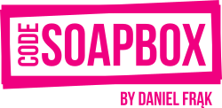

# Spring Boot with Kibana demo



This project is a sample Spring Boot application which sends its logs to Logstash, which in turn sends them to
Elasticsearch, making them viewable in Kibana.

To learn how to connect Kibana to your own Spring Boot application, read the post:

[Code Soapbox - How to browse Spring Boot logs in Kibana (configuring the Elastic Stack)](https://codesoapbox.dev/how-to-browse-spring-boot-logs-in-kibana-configuring-the-elastic-stack/)

## Getting Started

1. Clone the repository
```bash
$ git clone https://github.com/daniel-frak/openapi-client-code-generation.git
```

2. Start the required services
```bash
$ cd docker
$ docker-compose up
```

3. Start the application
```bash
$ cd ../
$ mvn spring-boot:run
```

## Built With

* Java 11
* [Spring Boot 2.2.5](https://start.spring.io/)
* [Maven](https://maven.apache.org/)

## License

This project is licensed under the MIT License - see the [license details](https://opensource.org/licenses/MIT).